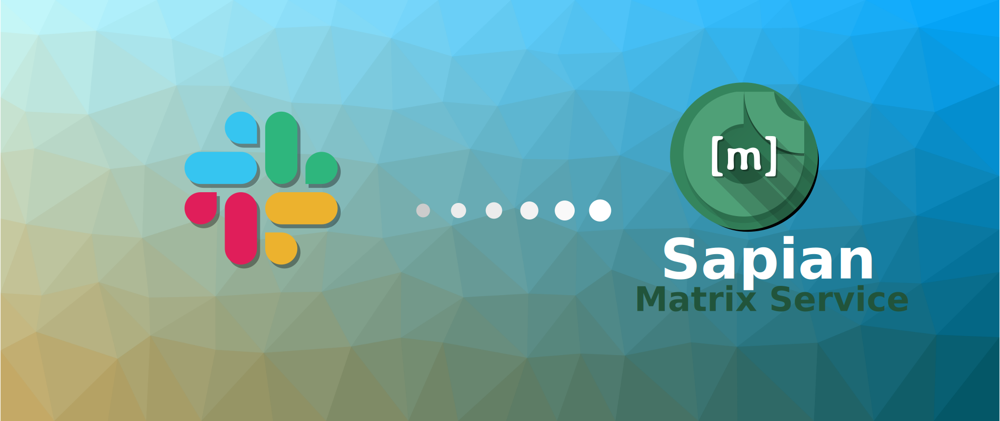
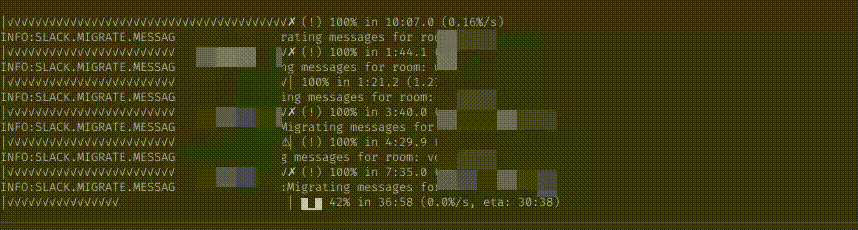

# Slack to Matrix Migration
This repo is just for push to Awesome-Technologies real repo here https://github.com/sapianco/slack-matrix-migration



This project is a fork from https://github.com/Awesome-Technologies/slack-matrix-migration

Migrates Users, Channels and all the conversations from a Slack export to Matrix
Warning: It's not recommended to use anything but a fresh/empty Synapse instance for migration

However, you can configure it to import the Slack workspace to an empty federated server
and use that to effectively migrate rooms to an existing Matrix server via federation.
See 'Federated setup (import to an existing Matrix server)' below.

# Why the Fork.

We need complete refactor directory project from [Awesome-Technologies/slack-matrix-migration](https://github.com/Awesome-Technologies/slack-matrix-migration)
To ensure the next enhacements.

- pip to pipenv
- Docker
- logging
- python 3.9
- alive-progress
  - 
- better logging
- Env configuration and dot.env support
- Fix massive Invites for large Slack Teams.


# Build And Push to docker registry

``` bash
version=0.1.1
docker build --build-arg BUILD_DATE=$(date -u +'%Y-%m-%dT%H:%M:%SZ') --build-arg VCS_REF=$(git rev-parse --short HEAD)  -t sapian/slak-matrix-migration:latest -t sapian/slak-matrix-migration:${version} --build-arg VERSION=${version} .
```

# build multiarch and push

``` bash
version=0.1.1
docker buildx build --push \
    --platform linux/arm64/v8,linux/amd64,linux/arm/v7 \
    --build-arg BUILD_DATE=$(date -u +'%Y-%m-%dT%H:%M:%SZ') \
    --build-arg VCS_REF=$(git rev-parse --short HEAD) \
    --tag custom/slak-matrix-migration:latest \
    --tag quay.io/custom/slak-matrix-migration:latest \
    --tag custom/slak-matrix-migration:${version} \
    --tag quay.io/custom/slak-matrix-migration:${version} \
    .
```

# Set developing enviroment

``` bash
conda create -n slak-matrix-migration python=3.9
/opt/$USER/anaconda3/envs/slak-matrix-migration/bin/pip install pipenv
/opt/$USER/anaconda3/envs/slak-matrix-migration/bin/pipenv --python=/opt/$USER/anaconda3/envs/slak-matrix-migration/bin/python install
/opt/$USER/anaconda3/envs/slak-matrix-migration/bin/pipenv --python=/opt/$USER/anaconda3/envs/slak-matrix-migration/bin/python install --dev
```

## Ipyhon

``` bash
cd ~/Workspace/slak-matrix-migration/
conda activate slak-matrix-migration
/opt/$USER/anaconda3/envs/slak-matrix-migration/bin/pipenv run ipython
```

## Activate Conda and Pipenv

``` bash
cd ~/Workspace/slak-matrix-migration/
conda activate slak-matrix-migration
/opt/$USER/anaconda3/envs/slak-matrix-migration/bin/pipenv shell
```

# Do migration

## Prerequisites
2. Set up a Synapse Homeserver
3. Create an admin user on the Homeserver (make sure the username of the admin user does not match any existing slack user id)
4. Copy `conf/matrix/migration_service.yaml` to somewhere reachable by your Homeserver
5. Replace the `as_token` and `hs_token` in the `conf/matrix/migration_service.yaml` with a random string
6. Add the Application Service to your `homeserver.yaml`:
```
app_service_config_files:
  - /<path to the yaml file>/migration_service.yaml
```
7. Restart Synapse

Notes:

- Make sure the migration script can access the `/_matrix/client` api and the `/_synapse` admin api
- Other Homeserver implementations may not support timestamped massaging, see https://matrix.org/docs/spec/application_service/r0.1.0#timestamp-massaging
- You may have to increase your homserver rate limits

## Federated setup (import to an existing Matrix server)

The idea is to migrate Slack to a fresh/empty Synapse instance, that is federated with your existing Matrix homeserver.
All imported Slack users will be kicked after the migration is done, leaving only the admin user in the migrated rooms.
Invite any users from your existing Matrix homeserver to the rooms manually using the admin user.

You will need the following configuration:

```yaml
# Set to 'True' to invite all users to all rooms
invite-all: True
# Set to 'True' to invite the admin user to all rooms
create-as-admin: True
# Set to 'True' to kick all imported users from imported rooms
kick-imported-users: True
# Set to 'True' to allow rooms to be joined from other homeservers
federate-rooms: True
# Append room and displayname suffixes
room-suffix: " (slack import)"
name-suffix: " (slack import)"
```

## Running the migration

## Set Enviroment variables
Fill de file `.env`

``` ini
#LOG_LEVEL=DEBUG
LOG_LEVEL=INFO
ADMIN_USER_MATRIX = changeme
ADMIN_PASS_MATRIX = changeme
PYTHONWARNINGS="ignore:Unverified HTTPS request"
```

### Local (see docker run)

1. [Set developing enviroment](#set-developing-enviroment)
2. [Activate Conda and Pipenv](#activate-conda-and-pipenv)
3. Get a zipped Export of your Slack Workspace (https://slack.com/help/articles/201658943) and put on `data/`
4. Copy `config/config_example.yaml` to `config/config.yaml` and edit to your needs (use the `as_token` from your `migration_service.yaml`)
5. Run `python3 slak-matrix-migration/slak-matrix-migration/migrate.py`

## Cleanup
1. Remove the Application Service from your `homeserver.yaml`
2. Delete the `migration_service.yaml`
3. Reset any increased rate limits
4. Restart Synapse


### Run in Docker

1. Get a zipped Export of your Slack Workspace (https://slack.com/help/articles/201658943) and put on `data/`

2. Copy `config/config_example.yaml` to `config/config.yaml` and edit to your needs (use the `as_token` from your `migration_service.yaml`)

3. Run Docker
  ``` Bash
  docker run --env-file .env -v $(pwd)/log:/app/log -v $(pwd)/data:/app/data -v $(pwd)/run:/app/run -v $(pwd)/conf:/app/conf --rm -it sapian slak-matrix-migration:latest
  ```
